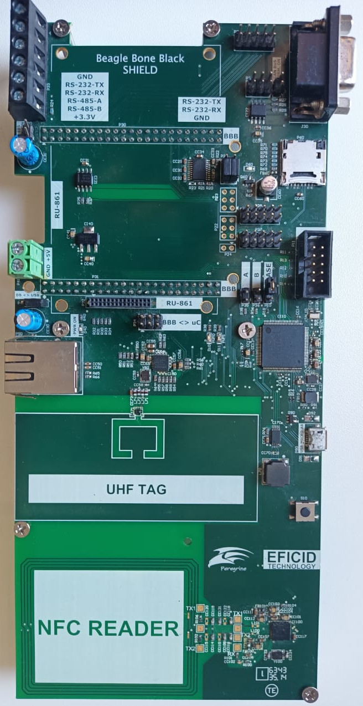

.. _byond_megaz0rd_board:

Byond MegaZ0rd
###################

Overview
********

The Byond MegaZ0rd development kit is a platform to develop IoT applications.
The main board uses an Atmel SAM4E series microcontrollers.  There are many
headers to expand tests besides all communication available.

Hardware
********

- ATSAM4E16E ARM Cortex-M4F Processor
- 12 MHz crystal oscillator
- Internal 32.768 kHz crystal oscillator
- CAN-bus (SN65HVD234 CAN Transceiver)
- RS-232 (SP3225EEY RS-232 Transceiver)
- RS-485 (SN65HVD72 RS-485 Transceiver)
- Ethernet port (KSZ8081MNXIA phy)
- Dynamic NFC/RFID tag IC with 4-Kbit EEPROM (M24LR04E-R)
- UHF EPC global Generation-2 UHF RFID tag (SL3S4011_4021)
- Near Field Communication (NFC) controller (PN532/C1)
- Micro-AB USB device
- MTI RU-861 UHF RFID Reader/Module native header
- RS-232/485 header
- DB-9 RS-232 connector
- SD card connector
- BeagleBone Black cape headers
- One reset pushbutton
- 2 user LEDs

Supported Features
==================

The sam4e_xpro board configuration supports the following hardware
features:

+-----------+------------+-------------------------------------+
| Interface | Controller | Driver/Component                    |
+===========+============+=====================================+
| NVIC      | on-chip    | nested vector interrupt controller  |
+-----------+------------+-------------------------------------+
| SYSTICK   | on-chip    | systick                             |
+-----------+------------+-------------------------------------+
| ETHERNET  | on-chip    | ethernet                            |
+-----------+------------+-------------------------------------+
| GPIO      | on-chip    | gpio                                |
+-----------+------------+-------------------------------------+
| I2C       | on-chip    | i2c                                 |
+-----------+------------+-------------------------------------+
| SPI       | on-chip    | spi                                 |
+-----------+------------+-------------------------------------+
| UART      | on-chip    | serial port                         |
+-----------+------------+-------------------------------------+
| USART     | on-chip    | serial port                         |
+-----------+------------+-------------------------------------+
| USB       | on-chip    | `SAM-BA`_ bootloader only           |
+-----------+------------+-------------------------------------+
| WATCHDOG  | on-chip    | watchdog                            |
+-----------+------------+-------------------------------------+

Other hardware features are not currently supported by Zephyr.

The default configuration can be found in the Kconfig
:zephyr_file:`boards/arm/byond_megaz0rd/byond_megaz0rd_defconfig`.

System Clock
============

The SAM4E MCU is configured to use the 12 MHz internal oscillator on the board
with the on-chip PLL to generate an 120 MHz system clock.

Serial Port
===========

The ATSAM4E16E MCU has 2 UARTs and 2 USARTs.

  - UART-0 shares with BeagleBone Black UART-2 the DB-9 RS-232 connector by
    P25.  The UART-0 is used to perform firmware upgrade by RS-232 using
    `SAM-BA`_ bootloader.
  - UART-1 is direct connected to BeagleBone Black UART-5
  - USART-0 can orientated to MTI module. It is shared with header P37 and
    CAN-Bus.
  - USART-1 shares with BeagleBone Black UART-4 the RS-485 lines.  The
    configuration is performed by P22 and P23.  The USART-1 is shared with
    the P38 header to expand connections.

Programming and Debugging
*************************

Flashing the Zephyr project onto SAM4E MCU doesn't requires any external tool.
It can be executed using `SAM-BA`_ bootloader.

Erase Firmware
==============

  - closing jumper ERASE
  - inject power to board by 10s
  - remove power
  - open ERASE jumper

Build/flash firmware
====================

Connect the Byond MegaZ0rd board to your host computer using the USB port or
the DB-9 by RS-232.  Then build and flash the :ref:`hello_world` application.

   .. zephyr-app-commands::
      :zephyr-app: samples/hello_world
      :host-os: unix
      :board: byond_megaz0rd
      :goals: build flash
      :compact:

To change the default tty port, simple add the :code:`--bossac-port /dev/ttyXX`
parameter.  For instance, to use :code:`/dev/ttyS0` instead
:code:`/dev/ttyACM0`.

   .. code-block:: console

      west build -b byond_megaz0rd samples/hello_world
      west flash --bossac-port /dev/ttyS0

Check new firmware
==================

Run your favorite terminal program to listen for output. Under Linux the
terminal should be :code:`/dev/ttyACM0` for USB or :code:`/dev/ttyS0` for
RS-232.  It will depend on your computer. For example:

   .. code-block:: console

      $ minicom -D /dev/ttyACM0 -o

   The -o option tells minicom not to send the modem initialization
   string. Connection should be configured as follows:

   - Speed: 115200
   - Data: 8 bits
   - Parity: None
   - Stop bits: 1

Press reset button.  You should see "Hello World! arm" in your terminal.

Debugging
*********

To debug the Byond MegaZ0rd board the `OpenOCD tool`_ is required.  By default
a factory new SAM4E chip will boot `SAM-BA`_ bootloader located in the ROM, not
the flashed image.  This is determined by the value of GPNVM1 (General-Purpose
NVM bit 1).  The flash procedure will ensure that GPNVM1 is set to 1 changing
the default behavior to boot from Flash.

If your chip has a security bit GPNVM0 set you will be unable to program flash
memory or connect to it via a debug interface. The only way to clear GPNVM0
is to perform a chip erase procedure that will erase all GPNVM bits and the
full contents of the SAM4E flash memory:

- With the board power off, set a jumper on the ERASE.
- Turn the board power on. The jumper can be removed soon after the power is on
  (flash erasing procedure is started when the erase line is asserted for at
  least 230ms)

Start Debugger
==============

You can debug an application in the usual way.  However, the `SAM-BA`_
bootloader is the default.  To select OpenOCD tool the runner parameter must
be passed as :code:`-r jlink`. Here is an example for the :ref:`hello_world`
application.

.. code-block:: console

   west debug -r jlink

References
**********

.. target-notes::

.. _OpenOCD tool:
    http://openocd.org/

.. _SAM-BA:
    https://www.microchip.com/developmenttools/ProductDetails/PartNO/SAM-BA%20In-system%20Programmer
