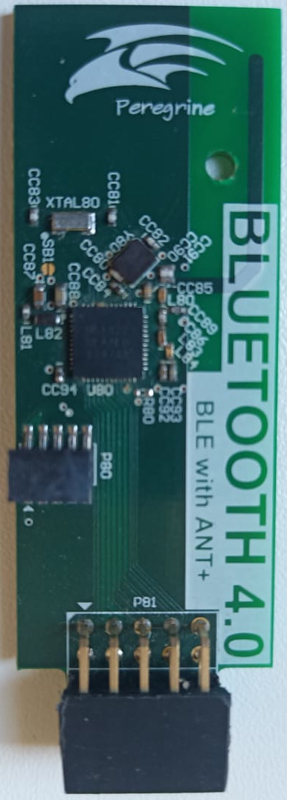

.. _byond_nrf51422_dongle:

Byond nRF51422 Dongle
#####################

Overview
********

The Byond nRF51422 Dongle provides support for the Nordic Semiconductor
nRF51422 ARM Cortex-M0 CPU.  It was designed to be used with
:ref:`byond_megaz0rd_board`.

Hardware
********

- nRF51422 ARM Cortex-M0 CPU
- 16 MHz crystal oscillator
- Internal 32.768 kHz crystal oscillator
- JTAG SWD connector
- 10-pin expansion header

Supported Features
==================

The Byond nRF51422 Dongle board configuration supports the following nRF51
hardware features:

+-----------+------------+----------------------+
| Interface | Controller | Driver/Component     |
+===========+============+======================+
| ADC       | on-chip    | adc                  |
+-----------+------------+----------------------+
| CLOCK     | on-chip    | clock_control        |
+-----------+------------+----------------------+
| FLASH     | on-chip    | flash                |
+-----------+------------+----------------------+
| GPIO      | on-chip    | gpio                 |
+-----------+------------+----------------------+
| I2C(M)    | on-chip    | i2c                  |
+-----------+------------+----------------------+
| NVIC      | on-chip    | arch/arm             |
+-----------+------------+----------------------+
| RADIO     | on-chip    | Bluetooth            |
+-----------+------------+----------------------+
| RTC       | on-chip    | system clock         |
+-----------+------------+----------------------+
| RTT       | Segger     | console              |
+-----------+------------+----------------------+
| SPI(M/S)  | on-chip    | spi                  |
+-----------+------------+----------------------+
| UART      | on-chip    | serial               |
+-----------+------------+----------------------+
| WDT       | on-chip    | watchdog             |
+-----------+------------+----------------------+

Other hardware features are not supported by the Zephyr kernel.

Programming and Debugging
*************************

Flashing/Debugging
==================

The Byond nrf51422 Dongle can be programmed/debugged only by JTAG, like J-link.
Build, flash and debug applications as usual (see :ref:`build_an_application`
and :ref:`application_run` for more details).

Here is an example for the :ref:`hello_world` application.

First, run your favorite terminal program to listen for output.

.. code-block:: console

   $ minicom -D <tty_device> -b 115200

Replace :code:`<tty_device>` with the port where the Byond nRF51422 Dongle
can be found.  For example, under Linux, :code:`/dev/ttyACM0`.

Then build and flash the application in the usual way.

.. zephyr-app-commands::
   :zephyr-app: samples/hello_world
   :board: _byond_nrf51422_dongle
   :goals: build flash debug
