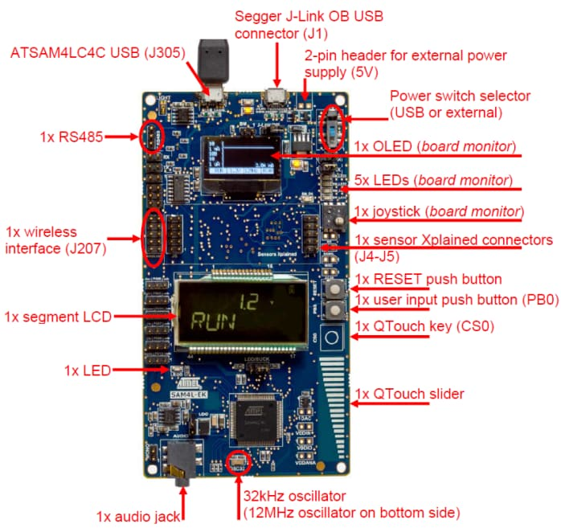

.. _sam4l_wm400_cape:

SAM4L WM-400 Cape
#################

Overview
********

The SAM4L WM-400 Cape is a full featured design to enable IEEE 802.15.4 low
power nodes. It is a Beaglebone Black cape concept with an Atmel AT86RF233
radio transceiver. User can develop Touch interface and have access to many
sensors and conectivity buses.

Hardware
********

- ATSAM4LC4B ARM Cortex-M4 Processor
- 12 MHz crystal oscillator
- 32.768 kHz crystal oscillator
- 1 RS-232 interface
- 1 RS-485 full duplex interface
- Micro-AB USB OTG host/device
- 1 user touch button and One user pushbutton
- 4 user LEDs
- 1 AT86RF233 IEEE 802.15.4 transceiver
- 1 MPL115A2 I²C Barometric Pressure/Temperature Sensor
- 1 VCNL4010 Proximity/Light Sensor
- 1 CC2D33S Advanced Humidity Temperature Sensor
- 1 NCP18WF104J03RB NTC Temperature Sensor
- 1 TEMT6000X01 Ambient Light Sensor

Supported Features
==================

The sam4l_wm400_cape board configuration supports the following hardware
features:

+-----------+------------+-------------------------------------+
| Interface | Controller | Driver/Component                    |
+===========+============+=====================================+
| NVIC      | on-chip    | nested vector interrupt controller  |
+-----------+------------+-------------------------------------+
| SYSTICK   | on-chip    | systick                             |
+-----------+------------+-------------------------------------+
| USART     | on-chip    | serial port                         |
+-----------+------------+-------------------------------------+
| I2C       | on-chip    | i2c                                 |
+-----------+------------+-------------------------------------+
| GPIO      | on-chip    | gpio                                |
+-----------+------------+-------------------------------------+
| Watchdog  | on-chip    | watchdog                            |
+-----------+------------+-------------------------------------+

Other hardware features are not currently supported by Zephyr.

The default configuration can be found in the Kconfig
:zephyr_file:`boards/arm/sam4l_wm400_cape/sam4l_wm400_cape_defconfig`.

Connections and IOs
===================

The `SAM4L WM-400 Cape Schematic`_ has detailed information about board
connections. Download the `SAM4L WM-400 Cape Schematic`_ for more detail.

System Clock
============

The SAM4L MCU is configured to use the 12 MHz internal oscillator on the board
with the on-chip PLL to generate an 48 MHz system clock.

Serial Port
===========

The ATSAM4LC4B MCU has 4 USARTs. One of the USARTs (USART3) is shared between
RS-232 and RS-485 interfaces. The default console terminal is available at
RS-232 onboard port.

Programming and Debugging
*************************

The SAM4L WM-400 Cape board needs a Segger `J-Link OB <https://www.segger.com/jlink-ob.html>`_.
This provides a debug interface to the SAM4LC4B chip. You can use Ozone or
JLink to communicate with the SAM4LC4B.

Flashing
========

#. Download JLink from the Segger `JLink Downloads Page`_. Go to the section
   "J-Link Software and Documentation Pack" and install the "J-Link Software and
   Documentation pack for Linux". The application JLinkExe needs to be accessible
   from your path.

#. Run your favorite terminal program to listen for output. Under Linux the
   terminal should be :code:`/dev/ttyACM0`. For example:

   .. code-block:: console

      $ minicom -D /dev/ttyACM0 -o

   The -o option tells minicom not to send the modem initialization
   string. Connection should be configured as follows:

   - Speed: 115200
   - Data: 8 bits
   - Parity: None
   - Stop bits: 1

#. Connect the SAM4L WM-400 Cape board to your host computer using the
   USB debug port. Then build and flash the :ref:`hello_world`
   application.

   .. zephyr-app-commands::
      :zephyr-app: samples/hello_world
      :board: sam4l_wm400_cape
      :goals: build flash

   You should see "Hello World! sam4l_wm400_cape" in your terminal.

Debugging
=========

You can debug an application in the usual way.  Here is an example for the
:ref:`hello_world` application.

.. zephyr-app-commands::
   :zephyr-app: samples/hello_world
   :board: sam4l_wm400_cape
   :maybe-skip-config:
   :goals: debug

References
**********

.. target-notes::

.. _SAM4L WM-400 Cape Online User Guide:
    http://ww1.microchip.com/downloads/en/DeviceDoc/Atmel-42026-ATSAM4L-EK-User-Guide_ApplicationNote_AVR32850.pdf

.. _JLink Downloads Page:
    https://www.segger.com/downloads/jlink

.. _SAM4L WM-400 Cape Schematic:
    http://ww1.microchip.com/downloads/en/DeviceDoc/doc42027_SAM4L-EK_Design_Documentation.PDF
